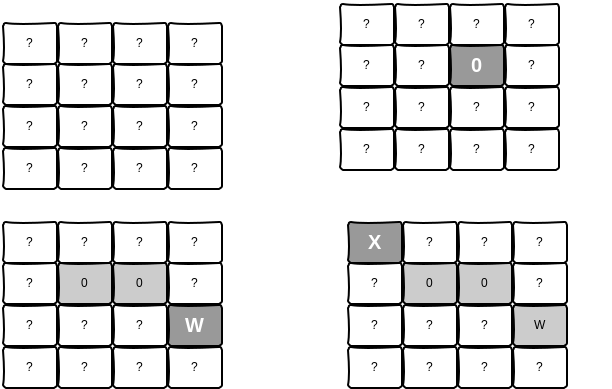

Enunciat
--------------------
1. Desenvolupeu un programa gràfic fent servir tècniques orientades a objectes.

> ### CONSELLS
> * PENSEU QUÈ HEU DE FER I COM FER-HO abans de fer coses rares que només us complicaran la vida.
> * Si abans de començar a programar apunteu què és el que voleu fer i com. Això em donarà més motius per poder-vos puntuar en el cas de que us encalleu programant o no teniu temps d’acabar.
> * Aneu amb compte amb els carrers foscos i la xocolata calenta!

Se us demana desenvolupar un joc amb entorn gràfic (swing o JavaFX) que consisteix en anar descobrint caselles fins que trobes una ‘X’.

Al començar les caselles tenen un interrogant i el botó “Reinicia pantalla” té el text “Començar”.

Quan es clica en una de les caselles es mostrarà què hi ha al darrere (el contingut s'ha de generar aleatòriament al començar la partida):

La partida acaba quan es troba una “X”. 

Mentre dura la partida es pot clicar a “Reinicia pantalla” que torna a posar tots els botons a “?” i en reordena el contingut. Amb aquesta operació no es perden els punts, ni s'acaba la partida.

Darrere del panell hi poden haver tres símbols:

| Valor | Efecte |
|-------|--------|
| 0     | Es suma un punt |
| W     | Es duplica la puntuació (En el quadrat n'hi ha entre 1 i 3) |
| X     | S’acaba la partida (En el quadrat n'hi ha dues) |

### Resum

El que es demana és: 

* El  projecte sigui «Maven» i que es pugui executar
Es poden fer parts del programa per evitar quedar­se encallat però ressalteu-ho amb comentaris dins del codi
* No només es valora que el programa funcioni, es valorarà l'estil, el plantejament  i que es facin servir les normes de programació adequades.
* Responsive compta, però no és bàsic
